<p align="center">
  
</p>

<p align="center">
  
  
  
  
  
  
</p>

<p align="center">
  <a href="#onkonixai-nedir">Proje</a> ·
  <a href="#demo">Demo</a> ·
  <a href="#platform-mimarisi">Mimari</a> ·
  <a href="#bronkovision">BronkoVision</a> ·
  <a href="#eğitim-hattı">Eğitim Hattı</a> ·
  <a href="#bronkovision-api">API</a> ·
  <a href="#yol-haritası">Yol Haritası</a>
</p>

<br/>

Bir bronkoskopi görüntüsü yüklüyorsunuz. Sistem:

- **Görüntüde kanser olup olmadığını söylüyor** ve kararı verirken görüntünün hangi bölgesine baktığını ısı haritasıyla gösteriyor.
- **Tümörü piksel düzeyinde çiziyor**, ardından boyutunu, şeklini, rengini ve doku yapısını ölçüyor.
- **Tek bir 2B kareden tümörün 3B modelini oluşturuyor**, hacmini ve ne kadar düzensiz büyüdüğünü hesaplıyor.
- **Hiperspektral veriden hipoksiyle ilişkili (oksijensiz) bölgeleri haritalıyor.** Bu bölgeler tedaviye dirençle ilişkilendirilir.

Bunları yapan modül, OnkoNixAI'nin görüntü analiz motoru **BronkoVision**.

<br/>

## OnkoNixAI nedir?

Akciğer kanseri, dünyada kansere bağlı ölümlerin başında gelir. Bir hastayla ilgili kritik bilgiler ise çoğu zaman birbirinden kopuk yerlerde durur: bronkoskopi görüntüleri bir sistemde, kan testleri ve sıvı biyopsi sonuçları başka bir sistemde, genetik profil ayrı bir raporda. Hekim bu parçaları zihninde birleştirmek zorunda kalır. Görüntülerin değerlendirmesi de büyük ölçüde göze dayanır ve kişiden kişiye değişir.

**OnkoNixAI bu parçaları bir araya getirir.** Görüntüleme, moleküler biyobelirteç ve klinik verileri birlikte analiz eden, hastaya özel tanı ve tedavi önerisi üreten **multimodal bir klinik karar destek platformudur.**

| | Geleneksel yaklaşım | OnkoNixAI |
|---|---|---|
| Görüntü değerlendirmesi | Görsel, sübjektif | Sayısal, tekrarlanabilir metrikler |
| Tümör morfolojisi | 2B gözlem | Otomatik segmentasyon + 3B model |
| Hipoksik bölgeler | Rutinde görülmez | Spektral analizle haritalanır |
| Biyobelirteçler | Tek tek, anlık değerler | Zaman içindeki değişimleriyle birlikte |
| Doz planı | Standart protokol | Hastaya özel optimizasyon |
| Model kararları | Kara kutu | Isı haritalarıyla açıklanabilir |

## Demo

<!--
  Videoları eklemek için: GitHub'da README'yi düzenlerken her mp4 dosyasını editöre sürükleyip bırakın.
  GitHub'ın ürettiği https://github.com/user-attachments/assets/... bağlantısını kopyalayıp
  aşağıdaki ilgili src="..." değerinin yerine yapıştırın, ardından editörde kalan bağlantı satırını silin.
-->

<table>
  <tr>
    <td align="center" width="33%">
      <video src="https://github.com/user-attachments/assets/b846c145-b82f-4eb7-be34-af986dcf788a
" controls muted width="100%"></video>
    </td>
    <td align="center" width="33%">
      <video src="https://github.com/user-attachments/assets/c22aa253-7d08-42b8-a67b-59c5ad452512
" controls muted width="100%"></video>
    </td>
    <td align="center" width="33%">
      <video src="https://github.com/user-attachments/assets/0a99c729-17f3-4894-8e39-8f0aaf55678b
" controls muted width="100%"></video>
    </td>
  </tr>


  <tr>
    <td align="center"><b>BronkoVision</b><br/><sub>Görüntü analizi</sub></td>
    <td align="center"><b>BiyoAnaliz</b><br/><sub>Biyobelirteç analizi</sub></td>
    <td align="center"><b>DozOptimize</b><br/><sub>Doz optimizasyonu</sub></td>
  </tr>
</table>

<p align="center"><sub><i>Test ve tanıtım amaçlı ekran kaydıdır. Görüntülenen hasta bilgileri, değerler ve skorlar demo verisidir.</i></sub><br/><sub>Videoları tam ekran izlemek için oynatıcıdaki tam ekran düğmesini kullanabilirsiniz.</sub></p>

## Platform mimarisi

OnkoNixAI, birbirini besleyen üç modülden oluşur:

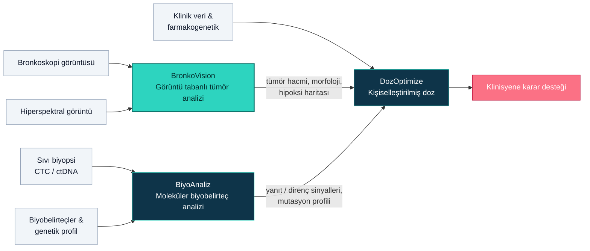

| Modül | Görev |
|---|---|
| **BronkoVision** | Bronkoskopi ve hiperspektral görüntülerden tümörü tespit eder, segmente eder, 3B modelini çıkarır ve hipoksi haritası üretir |
| **BiyoAnaliz** | CTC, ctDNA ve CEA, CYFRA 21-1, ProGRP, PD-L1 gibi biyobelirteçleri zaman içinde izler. Genetik mutasyon profilini (EGFR, ALK, ROS1, KRAS) ve immünoterapi yanıt potansiyelini değerlendirir |
| **DozOptimize** | Diğer iki modülün çıktılarını hastanın farmakogenetik profiliyle birleştirir. Etkinliği artıran, toksisiteyi azaltan kişisel doz önerileri üretir |

> [!NOTE]
> Bu repoda uçtan uca çalışan derin öğrenme hattı **BronkoVision**'dır. BiyoAnaliz ve DozOptimize ekranları, platformun bütününü göstermek için hazırlanmış arayüz prototipleridir; gösterilen analizler ve skorlar simüle edilmiş verilere dayanır.

Platform, **rol tabanlı bir Streamlit web arayüzü** olarak çalışır. Kullanıcı rolü (*Doktor, Yönetici, Laboratuvar Uzmanı, Radyoloji Uzmanı*) ve hasta seçildiğinde role uygun sekmeler açılır: **Ana Ekran · Biyoanaliz · Görüntü Analizi · Doz Optimizasyonu · Tedavi Planı**. Hasta verileri SQL Server'dan okunur.

<details>
<summary><b>Proje yapısı</b></summary>

```
NefesAI/
├── mainapp.py                  # Uygulamanın giriş noktası
├── database_connector.py       # SQL Server bağlantısı
├── models/                     # Hasta, ziyaret, kan testi, genetik belirteç veri sınıfları
├── repositories/               # Veri erişim katmanı
├── ui_components/              # Sidebar (hasta / rol seçimi) ve sekme yapısı
├── modules/
│   ├── image_analysis_page/    # BronkoVision
│   ├── bio_analysis/           # BiyoAnaliz
│   ├── dosage_optimization.py  # Doz optimizasyonu
│   ├── treatment_plan.py       # Tedavi planı
│   ├── home.py                 # Hasta genel bakış ekranı
│   └── all_patients.py         # Hasta listesi
└── assets/
```

</details>

<br/>

<a id="bronkovision"></a>
<p align="center">
  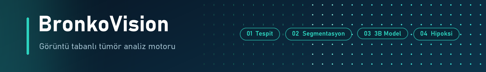
</p>

> [!NOTE]
> **Bu modülü ben geliştirdim.** Kaynak kod: [`modules/image_analysis_page/`](modules/image_analysis_page/)


BronkoVision, **dört derin öğrenme ve görüntü işleme aşamasını tek bir akışta** birleştirir. Bir bronkoskopi görüntüsü sırasıyla sınıflandırılır, segmente edilir ve 3B olarak modellenir. Hiperspektral veri yüklendiğinde, dördüncü aşamada bu veriden tümörün fonksiyonel (hipoksi) haritası çıkarılır. Klinisyen, tümörün **anatomik, morfolojik ve fonksiyonel** özelliklerini tek bir raporda görür.

<table>
  <tr>
    <td align="center" width="33%">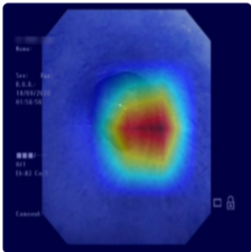</td>
    <td align="center" width="33%">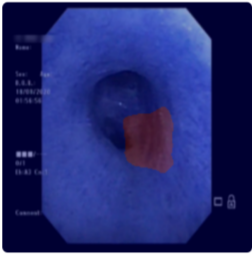</td>
    <td align="center" width="33%">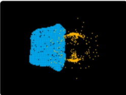</td>
  </tr>
  <tr>
    <td align="center"><b>Tespit</b><br/><sub>ResNet-152 + LayerCAM</sub></td>
    <td align="center"><b>Segmentasyon</b><br/><sub>Attention U-Net</sub></td>
    <td align="center"><b>3B Rekonstrüksiyon</b><br/><sub>PointNet Autoencoder</sub></td>
  </tr>
</table>

<p align="center">
  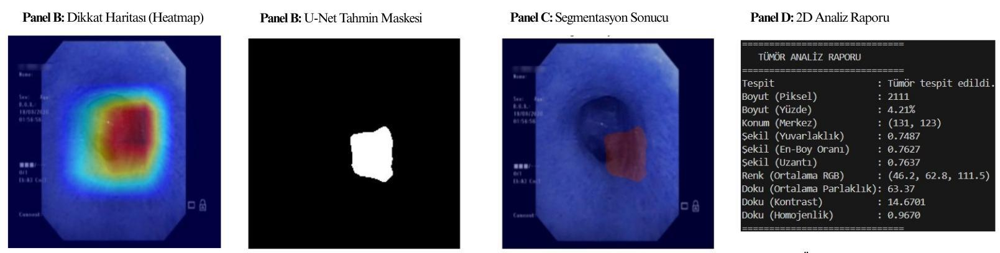
  <br/><sub>Gerçek bir bronkoskopi karesi üzerinde uçtan uca akış: dikkat haritası → U-Net maskesi → segmentasyon bindirmesi → otomatik tümör raporu</sub>
</p>

### Pipeline

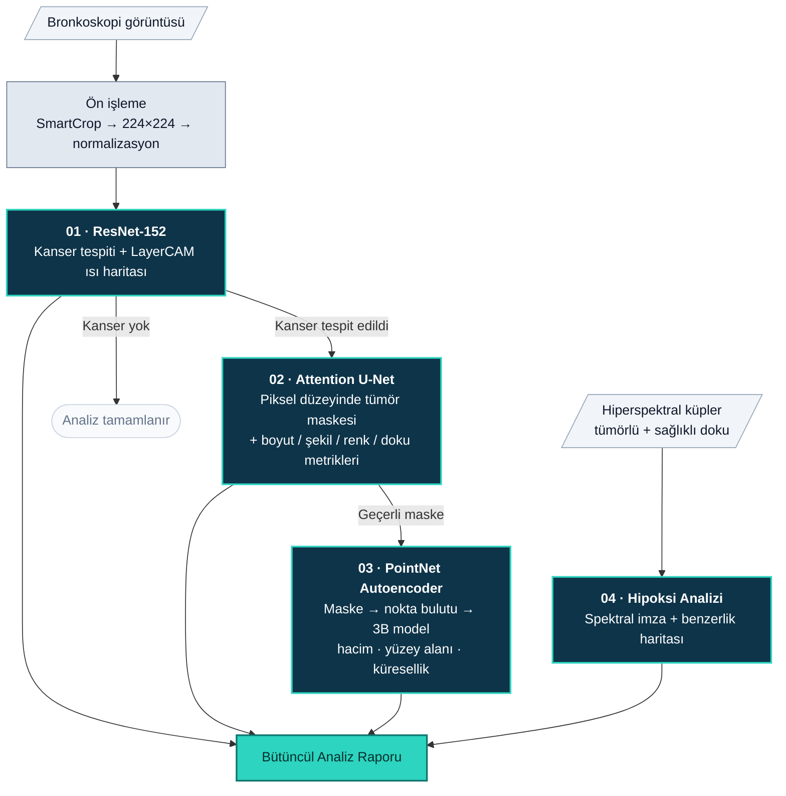

| Dosya | Görev |
|---|---|
| [`pipeline.py`](modules/image_analysis_page/pipeline.py) | `BronkoVisionPipeline`: tüm modelleri yönetir, her aşamayı ayrı metot olarak sunar |
| [`resnet.py`](modules/image_analysis_page/resnet.py) | Maskeli ResNet-152 sınıflandırıcı + LayerCAM |
| [`unet.py`](modules/image_analysis_page/unet.py) | Attention U-Net + kantitatif tümör analizi |
| [`pointnet.py`](modules/image_analysis_page/pointnet.py) | Nokta bulutu üretimi, PointNet Autoencoder, 3B metrikler, Open3D görselleştirme |
| [`hsi_analiz.py`](modules/image_analysis_page/hsi_analiz.py) | Hiperspektral hipoksi haritalama |
| [`image_analysis.py`](modules/image_analysis_page/image_analysis.py) | Streamlit arayüzü |

---

### 01 · ResNet-152 ile Kanser Tespiti

**Akıllı ön işleme: `SmartCrop`.** Bronkoskopi görüntülerinin etrafında endoskop çerçevesinden kaynaklanan siyah alanlar bulunur. `SmartCrop`, köşe pikselini arka plan kabul eder ve görüntüyü yalnızca dokunun olduğu bölgeye kırpar. Böylece model çerçeveyi değil dokuyu öğrenir.

**Model: `MultiLayerMaskedResNet`.** ResNet-152 omurgası iki özgün değişiklikle kullanılır.

**Çok katmanlı özellik haritası maskeleme.** `layer2` ve `layer3` çıkışlarındaki özellik haritalarının dış kenarlarından her yönde %30'luk şerit sıfırlanır:

```python
h_margin = int(h * 0.3); w_margin = int(w * 0.3)
features[:, :, :h_margin, :] = 0;  features[:, :, h-h_margin:, :] = 0
features[:, :, :, :w_margin] = 0;  features[:, :, :, w-w_margin:] = 0
```

Bu maskeleme, ağı **lezyonun bulunduğu merkez bölgeye odaklanmaya** zorlar. Kenarlardaki yansımaların, yazıların ve çerçeve artefaktlarının karara etkisi azalır. Aynı zamanda güçlü bir regülarizasyon etkisi yaratır ve aşırı öğrenmeyi azaltır.

**Özel sınıflandırma başlığı.**
```
2048 → Linear(512) → ReLU → Dropout(0.5) → Linear(2)   →  {Lung_cancer, Non_lung_cancer}
```

**Açıklanabilirlik: LayerCAM.** Son konvolüsyon bloğu (`layer4[-1]`) üzerinde **LayerCAM** ısı haritası hesaplanır ve orijinal görüntünün üzerine bindirilir. Hekim yalnızca "kanser var" sonucunu değil, **modelin bu karara görüntünün hangi bölgesine bakarak vardığını** da görür.

### 02 · Attention U-Net ile Segmentasyon ve Kantitatif Analiz

**Mimari.**
- **Encoder:** 5 seviye, **64 → 128 → 256 → 512 → 1024** kanal. Her seviyede 2× (Conv3×3 → BatchNorm → ReLU) ve MaxPool.
- **Decoder:** Transpoze konvolüsyonla yukarı örnekleme ve skip bağlantıları.
- **Attention Gate'ler:** Her skip bağlantısında decoder sinyali `g` ile encoder özelliği `x` birleştirilerek bir dikkat katsayısı üretilir:

  ```
  ψ = σ( BN(Conv1×1( ReLU( W_g·g + W_x·x ) )) )        çıktı = x · ψ
  ```

  Ağ, ilgisiz arka planı bastırırken **tümör sınırlarını ve dokusal detayları** öne çıkarır.
- **Çıkış:** Sigmoid ve 0,5 eşiği ile 224×224 ikili tümör maskesi.

**Kantitatif tümör profili.** Maske üzerinden OpenCV ve scikit-image ile 10 metrik hesaplanır:

| Kategori | Metrik | Nasıl hesaplanır? | Ne anlatır? |
|---|---|---|---|
| Boyut | Piksel alanı, görüntüye oranı | Maskedeki piksel sayısı | Lezyonun büyüklüğü |
| Konum | Ağırlık merkezi | Kontur momentleri (`m10/m00`, `m01/m00`) | Lezyonun yeri |
| Şekil | **Dairesellik** | 4πA / P² | 1'e yakınsa düzgün, düşükse düzensiz sınır |
| | En-boy oranı | Sınırlayıcı kutu genişlik / yükseklik | Uzama eğilimi |
| | Uzantı (extent) | Kontur alanı / sınırlayıcı kutu alanı | Dolgunluk / girintililik |
| Renk | Ortalama RGB | Maske içi piksel ortalaması | Lezyon dokusunun rengi |
| Doku | Ortalama parlaklık | Gri seviye ortalaması | Yoğunluk |
| | **GLCM kontrast & homojenlik** | Gri seviye eş-oluşum matrisi | Doku heterojenliği |

Düzensiz sınırlar ve heterojen doku, klinikte malignite ve invazivlikle ilişkilendirilen bulgulardır. BronkoVision bu bulguları **sayılara dönüştürür.**

### 03 · Tek Bir 2B Görüntüden 3B Tümör Modeli

1. **Maskeden nokta bulutuna.** Tümör maskesine **Öklid uzaklık dönüşümü** uygulanır. Her pikselin tümör sınırına uzaklığı normalize edilerek **derinlik (z)** olarak kullanılır. Sınır düz kalırken merkez yükselir ve tümör kubbe biçimli bir 3B yüzey olarak modellenir.
2. **Örnekleme ve normalizasyon.** Nokta bulutu **2048 noktaya** örneklenir, merkezlenir ve birim küre içine ölçeklenir.
3. **PointNet Autoencoder.**

   ```
   Encoder:  (2048×3) → Conv1d 64 → 128 → 256  → global max-pool → 256-boyutlu şekil kodu
   Decoder:  256 → FC 512 → FC 1024 → FC 2048·3 → (2048×3) yeniden oluşturulmuş bulut
   ```

   Encoder her noktaya paylaşımlı bir MLP uygular, ardından **max-pooling** ile nokta sırasından bağımsız global bir şekil tanımlayıcısı çıkarır. Decoder bu koddan, girdideki düzensiz noktalara göre **daha düzgün ve tutarlı** bir 3B tümör yüzeyi oluşturur.
4. **3B morfolojik metrikler.** Yeniden oluşturulan bulut üzerinde dışbükey zarf (Convex Hull) hesaplanır. Bulut normalize edildiği için değerler göreceli birimdedir:

| Metrik | Formül | Anlamı |
|---|---|---|
| Hacim | Convex Hull hacmi | Tümörün 3B büyüklüğü |
| Yüzey alanı | Convex Hull alanı | Çevre dokuyla temas yüzeyi |
| **Küresellik** | Ψ = π^(1/3) · (6V)^(2/3) / A | 1 = mükemmel küre. Küresellikten sapma, **düzensiz büyümenin ve olası invazivliğin** göstergesi olarak kullanılır |

### 04 · Hiperspektral Görüntüleme ile Hipoksi Haritası

> [!IMPORTANT]
> Tümörün oksijen almayan (hipoksik) bölgeleri, **radyoterapi ve kemoterapiye karşı dirençle** ilişkilendirilir. Bu bölgeleri tedavi öncesinde görmek, doz artırımı veya hipoksiye yönelik ilaç seçimi gibi kararlar için kritik bilgi sağlar.

Oksijenli (HbO₂) ve oksijensiz (Hb) hemoglobin ışığı farklı dalga boylarında farklı soğurur. Bu yüzden her dokunun bir **spektral parmak izi** vardır. BronkoVision bu parmak izini okur:

1. Tümörlü ve sağlıklı doku küplerinin merkezindeki 10×10 piksellik bölgeden **referans spektral imzalar** çıkarılır. Tümörlü dokunun imzası hipoksik referans olarak kullanılır.
2. Tümör küpündeki **her pikselin spektrumu**, hipoksik referans imzayla **kosinüs benzerliği** üzerinden karşılaştırılır:

   ```
   sim(p) = (s_p · s_ref) / (‖s_p‖ · ‖s_ref‖)
   ```

   Bu ölçüt spektrumun genliğine değil **şekline** bakar, bu sayede genel aydınlatma şiddetindeki farklardan etkilenmez (Spectral Angle Mapper prensibi).
3. Benzerlik haritası sözde-RGB görüntünün üzerine bindirilir ve **hipoksik bölgeler renkli bir harita** olarak görünür.

**Veriyi web'e hazırlamak.** Ham hiperspektral küpler (1004 × 800 piksel, 400–1000 nm aralığında **826 spektral bant**, 16 bit) beyaz ve karanlık referanslarla radyometrik olarak kalibre edilir: `R = (ham − karanlık) / (beyaz − karanlık)`. Ardından komşu 5 bant ortalanarak **165 banda** indirilir ve `float16` olarak `.npz` formatında saklanır. Bant sayısındaki 5 kat azalma ve `float32 → float16` dönüşümüyle, kalibre edilmiş küpün boyutu yaklaşık **10 kat** küçülür.

<p align="center">
  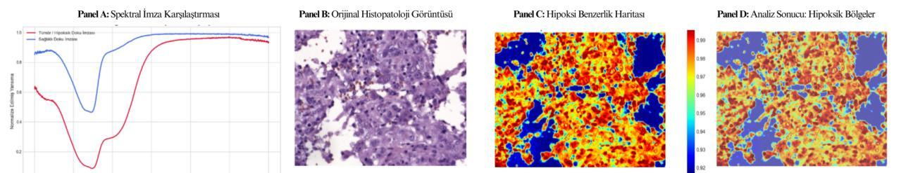
  <br/><sub>Tümörlü (kırmızı) ve sağlıklı (mavi) dokunun spektral imzaları ~550–580 nm'deki hemoglobin soğurma bölgesinde ayrışıyor · H&E görüntüsü · piksel bazlı hipoksi benzerlik haritası · hipoksik bölgelerin dokuya bindirilmiş hali</sub>
</p>

Hemoglobin oksijenlenmesinin spektral prensibi doku tipinden büyük ölçüde bağımsız olduğu için yöntem farklı dokulara uyarlanabilir. Konsept kanıtlaması, etiketli hiperspektral **tümör histopatolojisi** görüntüleri üzerinde yapılmıştır.

## Eğitim hattı

Üç model, birbirini besleyen tek bir hatta eğitildi.

> [!TIP]
> Eğitimde **yalnızca görüntü düzeyinde etiket** (kanser / kanser değil) kullanıldı. **Piksel düzeyinde hiçbir maske elle çizilmedi.** Segmentasyon ve 3B modeller, sınıflandırıcının dikkat haritalarından türetilen verilerle öğrendi.

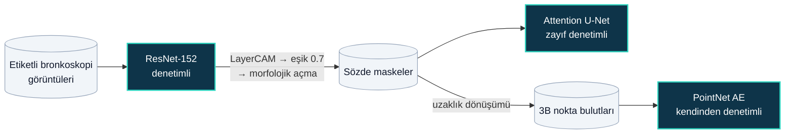

- **ResNet → U-Net:** Eğitilmiş sınıflandırıcının kanserli görüntülerdeki LayerCAM dikkat haritaları eşiklenip temizlenerek **sözde maskelere** dönüştürülür. Bu haritalar 7×7 çözünürlüklü özellik haritasından geldiği için kabadır. U-Net, bu sözde maskeleri hedef alarak görüntüden doğrudan, tam çözünürlükte tümör maskesi üretmeyi öğrenir (*pseudo-labeling*).
- **Sözde maskeler → PointNet:** Aynı sözde maskeler uzaklık dönüşümüyle 3B nokta bulutlarına çevrilir. Autoencoder, girdisini yeniden üreterek tümör şekillerinin 256 boyutlu bir temsilini öğrenir; bu aşamada da etiket gerekmez. Çıkarım sırasında ise girdi, U-Net'in ürettiği maskeden oluşturulur.

| | ResNet-152 | Attention U-Net | PointNet AE |
|---|---|---|---|
| Parametre | 59,2 M | 31,4 M | 7,0 M |
| Başlangıç | ImageNet | Rastgele | Rastgele |
| Kayıp | Sınıf ağırlıklı CE | 0,5 · BCE + 0,5 · Dice | Chamfer Distance |
| Optimizer · lr | AdamW · 1e-4 | AdamW · 1e-4 | AdamW · 1e-5 |
| Batch · maks. epoch | 16 · 50 | 8 · 50 | 16 · 200 |
| Erken durdurma (sabır) | 10 | 7 | 15 |

Üç modelde de ReduceLROnPlateau zamanlayıcısı ve %80/%20 eğitim/doğrulama ayrımı kullanıldı. En düşük doğrulama kaybını veren ağırlıklar saklandı.

**Modele özgü detaylar**

- **ResNet-152:** Aşırı öğrenmeye karşı üç önlem birlikte kullanıldı: ara katmanlarda özellik maskeleme, `Dropout(0.5)` ve AdamW weight decay. Veri artırma için çevirme, ±15° döndürme ve parlaklık/kontrast değişimi uygulandı.
- **Attention U-Net:** Tümör görüntünün küçük bir kısmını kaplar. Bu yüzden kayba BCE'nin yanında Dice da eklendi; böylece model "her yer arka plan" tahminine kaçamaz. Maskeler en yakın komşu interpolasyonuyla boyutlandırıldı ki etiketler kesin 0/1 kalsın.
- **PointNet AE:** Nokta bulutları sırasız olduğu için kayıp olarak sıradan bağımsız **Chamfer mesafesi** kullanıldı. Her epoch'ta buluttan farklı 2048 nokta örneklendi; böylece model tek tek noktaları değil şeklin kendisini öğrenir.

<table>
  <tr>
    <td align="center" width="50%">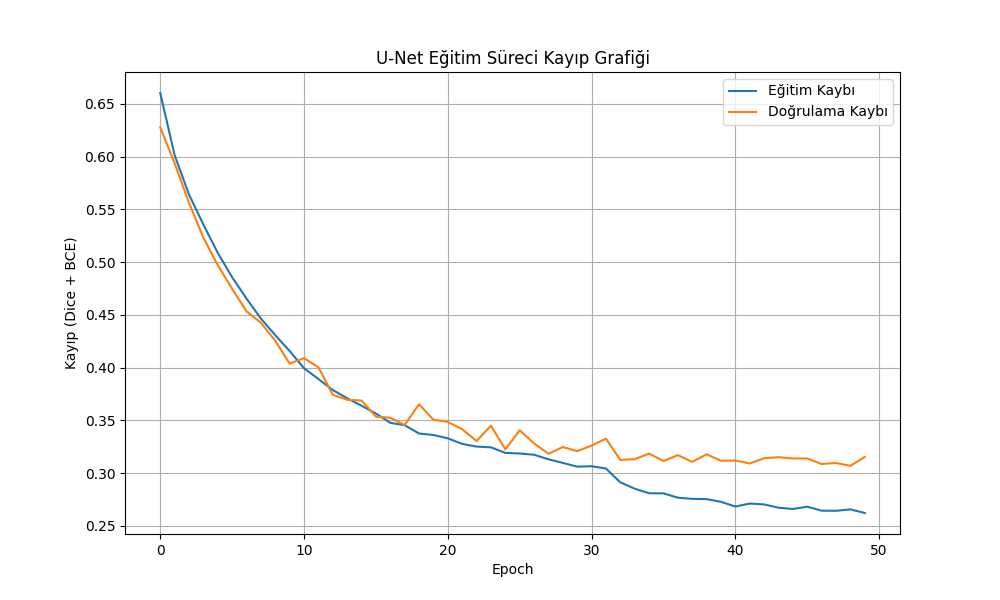</td>
    <td align="center" width="50%">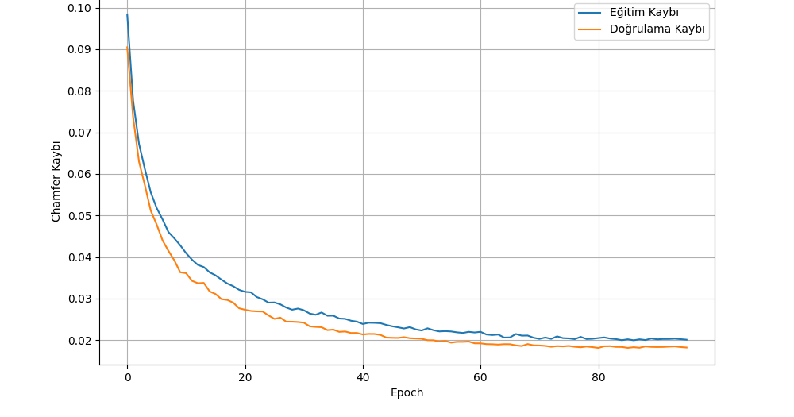</td>
  </tr>
  <tr>
    <td align="center"><sub>Attention U-Net · Dice + BCE kaybı</sub></td>
    <td align="center"><sub>PointNet Autoencoder · Chamfer kaybı</sub></td>
  </tr>
</table>

### Arayüz

**Görüntü Analizi** sekmesinde bronkoskopi görüntüsü (PNG/JPG) ve isteğe bağlı olarak tümörlü/sağlıklı doku hiperspektral verileri (`.npz`) yüklenir. **TÜM ANALİZLERİ BAŞLAT** ile aşamalar sırayla çalışır ve **Bütüncül Analiz Raporu** her aşamayı ayrı panelde gösterir.

## BronkoVision API

Tüm görüntü analiz hattı tek bir sınıf üzerinden çağrılır:

```python
from modules.image_analysis_page.pipeline import BronkoVisionPipeline

bv = BronkoVisionPipeline(resnet_path, unet_path, pointnet_path)

tespit  = bv.run_resnet_analysis("bronkoskopi.png")          # sınıf, güven skoru, ısı haritası
segment = bv.run_unet_analysis("bronkoskopi.png")            # maske + boyut, şekil, renk, doku metrikleri
model3d = bv.run_pointnet_analysis(segment["mask_image"])    # 3B model + hacim, yüzey alanı, küresellik
hipoksi = bv.run_hypoxia_analysis(tumor_npz_bytes, healthy_npz_bytes)  # spektral imzalar + hipoksi haritası
```

Arayüz `streamlit run mainapp.py` ile başlatılır. Eğitilmiş model ağırlıkları (`modules/image_analysis_page/models/` altında beklenir) ve hasta veritabanı repoya dahil değildir.

## Yol haritası

- [ ] **Histolojik alt tip sınıflandırması:** adenokarsinom, skuamöz hücreli karsinom ve küçük hücreli karsinomun ayrımı
- [ ] **Hasta bazlı çapraz doğrulama:** aynı hastanın görüntülerinin yalnızca eğitimde ya da yalnızca doğrulamada bulunduğu k-fold değerlendirme ve dış merkez verisiyle test
- [ ] **Uzman anotasyonlarıyla çok sınıflı segmentasyon:** sözde maskelerin uzman poligon anotasyonlarıyla desteklenmesiyle tümör, mukozal infiltrasyon, damar artışı ve stenozun ayrı ayrı segmente edilmesi
- [ ] **Mikroçevre segmentasyonu:** tümör infiltre eden lenfositler (TIL), damar yapıları ve fibroblast aktivitesinin segmentasyonu
- [ ] **Video tabanlı gerçek 3B rekonstrüksiyon:** bronkoskopi sekanslarından derinlik tahmini ve hiyerarşik PointNet++ encoder
- [ ] **Akciğer hiperspektral verisi:** hipoksi haritalamanın akciğer bronkoskopisine taşınması ve Hb/HbO₂ spektral ayrıştırmasıyla doğrudan oksijen satürasyonu (StO₂) ölçümü
- [ ] **DICOM desteği** ve hastane PACS sistemleriyle entegrasyon
- [ ] **DozOptimize entegrasyonu:** hipoksi haritası ve 3B tümör metriklerinin doz optimizasyonuna doğrudan aktarılması

## Teknolojiler

| Alan | Araçlar |
|---|---|
| Derin öğrenme | PyTorch, torchvision, pytorch-grad-cam |
| Görüntü işleme | OpenCV, scikit-image, Pillow, spectral |
| 3B analiz | Open3D, SciPy |
| Arayüz & görselleştirme | Streamlit, Plotly, Matplotlib |
| Veri | SQL Server, pandas |

> [!CAUTION]
> OnkoNixAI bir araştırma projesidir ve klinik kullanım için onaylanmış bir tıbbi cihaz değildir. Çıktıları tanı veya tedavi kararının yerine geçmez.
